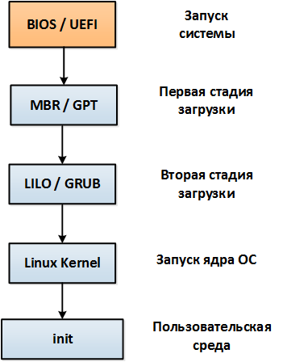
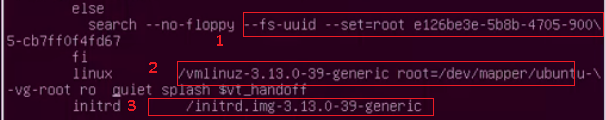
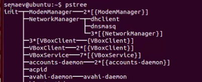
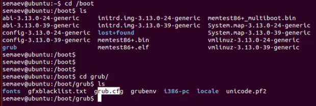

# 101.2 Загрузка системы

> [To Index](index.md)

Студент должен разбираться в процессе загрузки системы.

### Изучаем:

-	команды и опции загрузчика;
-	настройку последовательности загрузки в BIOS;
-	включение и выключение ПК;
-	стили инициализации системы;
-	журналы загрузки системы.

#### Термины и утилиты:	

-	dmesg
-	BIOS
-	bootloader
-	kernel
-	initramfs
-	init
-	SysVinit
-	systemd

Процесс загрузки любой операционной системы, представляющий собой последовательную работу ряда программных и аппаратных компонентов ПК, будет рассмотрен в этом уроке.

Вкратце процесс загрузки выглядит так:

- при старте ПК процессор переходит на адрес BIOS (UEFI) и загружает его;
- BIOS (или современный UEFI) проводит необходимые проверки, выбирает согласно своим настройкам носитель информации;
- на носителе находит MBR (или GPT для UEFI) в которой находится загрузчик;
- дальше по обстоятельствам: загрузчик может загружать ОС, может передать управление следующему загрузчику по цепочке;
- в любом случае загрузчик знает где лежит ядро ОС, грузит его и Initial Ram Disk (там конфигурационные файлы и модули необходимые для загрузки ядра) в оперативную память;
- загруженное ядро берет дальнейший процесс запуска на себя (инициализация устройств, конфигурирование процессора, памяти и т.д.)
- после всех инициализационных процедур ядро запускает процедуры инициализации всех необходимых служб ОС.

Существуют различные загрузчик ОС, например Lilo и Grub для Linux, NTLDR для Windows и т.д. Все они, как правило, имеют файл конфигурации самого загрузчика (формат диалога загрузки, таймауты для выбора варианта загрузки, поле для ввода дополнительных опций и т.д.) и секцию доступных для загрузки образов ОС.

Подробно стили инициализации и загрузчики рассматриваются в дальнейших уроках. Для успешного освоения данной темы необходимо знать, что в момент загрузки можно нажать выделенные клавиши (как, правило, отличающиеся у разных загрузчиков), и выбрать ОС для запуска или указать дополнительные опции загрузки.

- для GRUB это будет Shift (до версии 2 -- Esc)
	- e - редактировать выбранную строку параметров загузки (конкретно для текущей. чтобы внести постоянные изменения, надо править конфиг)
	

1 - корень монтируется в раздел жд, кот. указан по ID  
2 - где на корневом разделе находится ядро (здесь 3.13)  
3 - образ рамдиска для загрузки в оперативку

При работе с загрузчиком можно увидеть следующие понятия:
-	uuid – идентификатор носителя информации с установленной ОС;
	> `sudo blkid /dev/sda/`
-	kernel – путь к ядру ОС;
-	initrd – путь к минимальному образу ядра для загрузки в оперативную память;
-	quiet – не показывать процесс загрузки;
-	splash – показать заставку при загрузке.

Вся информация о загрузке хранится в журнале /var/log/dmesg (журнал событий ядра -- **только загрузка**), при этом данные о последней загрузке можно получить, выполнив команду `dmesg`. Также события загрузки могут располагаться в журнале /var/log/boot.log. В современных ОС события загрузки можно увидеть при помощи утилиты journalctl, например командой `journalctl -b0 SYSLOG_PID=1`

Процесс инициализации системы, **init**, будет рассмотрен подробно в дальнейших уроках, на данном этапе нужно знать о существование трех стилей инициализации:

-	SysV – родительский процесс инициализации системы на одном из заданных уровней запуска (runlevel);
-	systemd – родительский процесс инициализацию системы в ускоренном режиме, за счёт параллельного запуска задач;
-	upstart – родительский процесс инициализации системы на основе отслеживания событий (соврем. Ubuntu).

Содержимое каталогов /boot, /boot/grub  

#### pstree

- `yum install psmisc`

---

> [Next](101_3.md)