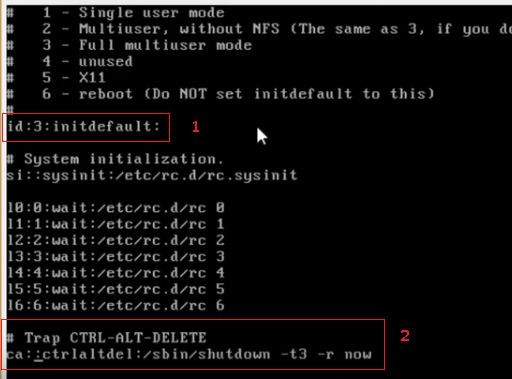
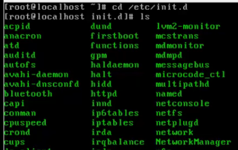
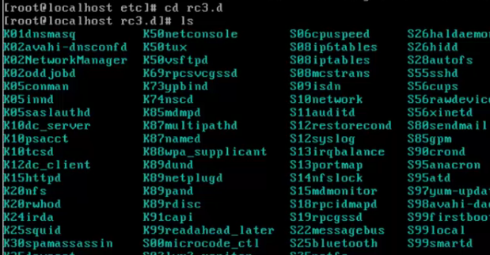
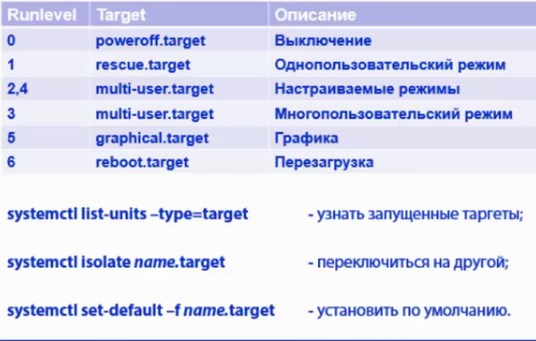
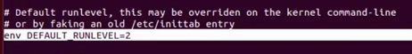
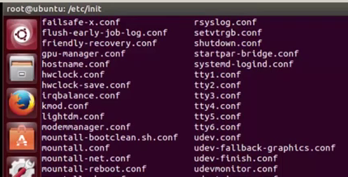
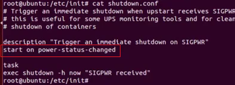
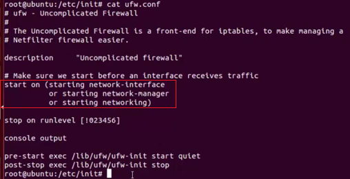
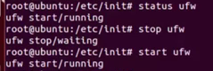

# 101.3 Инициализация системы

Студент должен уметь управлять уровнями выполнения SysV (runlevels) или целями загрузки systemd (boot target). Также в теме рассматриваются переключение в однопользовательский режим, выключение и перезагрузка системы, предупреждение пользователей, настройки уровня запуска ОС по умолчанию. Также нужно быть знакомыми с инициализацией в стиле upstart.

### Изучаем:

- установка варианта загрузки по умолчанию;
- переключение между режимами работы;
- включение и выключение ПК;
- уведомление пользователей системы;
- корректное завершение процессов.

### Термины и утилиты:	

- /etc/inittab
- shutdown
- init
- /etc/init.d/
- telinit
- systemd
- systemctl
- /etc/systemd/
- /usr/lib/systemd/
- upstart
- inictl
- wall

Инициализация системы это процесс запуска скриптов, подготавливающих ОС к работе. Существует несколько различных стилей инициализации системы, использующиеся в разных семействах и даже в разных релизах ОС.

Классическим методом инициализации ОС является инициализация в стиле SysV (в современных OC Linux практически не используется). Ключевым демоном является init (/sbin/init), являющийся родительским процессом, запускающим все остальные. Посмотреть дерево процессов и увидеть родительский можно командой pstree (для в centos нужно установить пакет psmisc)

## Инициализация в стиле SysV

Инициализация в стиле SysV оперирует с понятием уровня выполнения (runlevel), представляющего собой следующие режимы загрузки ОС:

0 – выключение;  
1 – однопользовательский режим;  
2 – Debian/Ubuntu по умолчанию (GUI или CUI);  
3 – RedHat/Suse по умолчанию (режим CUI);  
4 – WildCard (программируемый режим);  
5 – RedHat/Suse по умолчанию (режим GUI);  
6 – перезагрузка.

Увидеть данный режим можно в центос до 6 версии.

Настройки загрузки по умолчанию указываются в файле /etc/inittab (конфигурационный файл инициализации системы), например:

1 - id:3:initdefault:	(уровень загрузки по умолчанию - третий);  
2 - поведение по нажатию указанной комбинации.

Все скрипты, использующиеся для запуска служб, располагаются в директории /etc/init.d, например:

- `/etc/init.d/network restart`	(перезапустить службу сети);
- `service network stop`

В каталоге /etc находятся директории rc0.d, rc1.d (и т.д.), содержащие в себе наборы скриптов (точнее ссылки на скрипты), использующиеся при переключении в разные режимы работы, например в rc3.d находятся скрипты выполняющиеся на runlevel3.

- Некоторые скрипты (имя начинается с “S”) запускают демоны, а некоторые (имя начинается с “K”) – останавливают.  
- цифры -- последовательность выполнения.

Для работы с уровнями выполнения используют следующие команды:
init или telinit	- переключение в режима запуска;
runlevel		- узнать текущий режим работы;
halt		- выключить ОС;
reboot		- перезагрузить ПК;
shutdown	- завершить работу ПК.

Для управления демонами используется команда service имя_демона с ключами (не у всех демонов в конфиге могут присутствовать все перечисленные команды, зачастую можно увидеть ленивый скрипт только с командами start и stop):

`service serv_name start | stop | ...`

- start	- запустить;
- status	- показать состояние;
- stop	- остановить;
- restart	- перезапустить;
- reload	- перезагрузить конфигурационный файл службы.

`runlevel` -- какой режим исп-ся  
`telinit 1` -- перекл в 1 польз режим без перезагрузки  
`wall "Some text"` -- оповещение других польз-й  
`shutdown -h now` -- выключение

## Инициализация в стиле systemd

Более современный стилем инициализации является systemd. Сейчас он используется на большинстве современных дистрибутивов Linux (Centos 7.0 и выше, Ubuntu 15.10 и выше), за счет ускорения загрузки (распараллеливание запуска демонов) и автоматической отказоустойчивости (отслеживание состояния демонов).

 Использует понятие модулей (units), которыми могут быть

- службы (.service),  
- точки монтирования (.mount),  
- устройства (.device) или  
- сокеты (.socket).

Модули (юниты) создаваемые автоматически после установки пакетов ПО располагаются в директории /usr/lib/systemd/. Также можно располагать юниты в директориях /etc/systemd/system/ (для ОС в целом) или /etc/systemd/user/ (для пользователей).

Для управления юнитами используется утилита systemctl, например:

- `systemctl list-units`	(показать запущенные юниты);
- `systemctl list-units --type=service`
- `systemctl start network.service`	(запустить демон сети);
- `systemctl status crond`	(показать статус демона планировщика).

Вместо runlevel в systemd используется понятие target (цели), только в отличии от уровней выполнения они не пронумерованы, некоторые из них могут быть запущены одновременно. Target обратно совместимы с инициализацией sysV, поэтому можно использовать команду telinit для переключения в другой режим выполнения. 

Рисунок 1. Таргеты инициализации
Для управления режимами работы также используется утилита systemctl, например:

`systemctl isolate reboot.target`		(выполнить таргет reboot);  
`systemctl set-default -f multi-user.target`	(установить таргет multi-user в качестве режима загрузки по умолчанию);

Для управления питаем также можно использовать systemctl, например:

`systemctl reboot`		(перезагрузить ПК);  
`systemctl poweroff`	(выключить ПК).

Важная особенность systemd – гибкая система журналирования journald, собирающая информацию из различных источников и привязывающая ее к различным юнитам. Примеры ее использования:

journalctl –f	(просмотр сообщений в режиме реального времени);  
journalctl -n10 	(просмотр 10 последних сообщений);  
journalctl _UID=70	(вывод всех сообщений включающих пользователя с ID=70);

## upstart

В исторической перспективе отмечаем систему инициализации системы является upstart, опирающуюся в своей работе **на события**, происходящие в ОС. Она использовалась в ubuntu с версии 6.10 по 15.04, и во многих других дистрибутивах, которые сейчас уже используют systemd.
Upstart оперирует понятиями

- служба (**service**), поддерживаемая в постоянном режиме работы, и 
- задача (**task**), выполняющаяся разово.

В процессе инициализации upstart считывает настройки из файлов конфигурации (заданий - jobs) в каталоге `/etc/init/`. Каждое задание представляет собой сценарии запуска демонов с различными критериями и условиями выполнения.
Уровень инициализации по умолчанию указывается в файле **/etc/init/rc-sysinit.conf**

Для управления инициализацией в стиле upstart используется утилита initctl, например:

- `initctl start networking	`(запустить службу сети);
- `initctl list` 		(вывести перечень служб);

Каталог с файлами заданий (jobs) \*.conf. Это обычные скрипты запуска служб, каждый из которых отвечает за запуск отдельной службы.

Все задания запускаются по условиям -- это характерная особенность upstart-a.

Упр-е службами в Ubuntu

`initctl show-config`  
`initctl check-config`

-----
Для возможности извещения в любых дистрибутивах Linux всех пользователей, работающих в системе, о каких-либо действиях можно воспользоваться командой wall “текст_сообщения”.