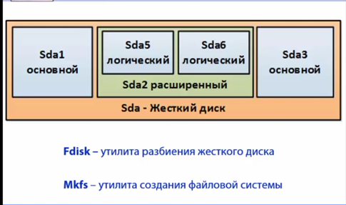
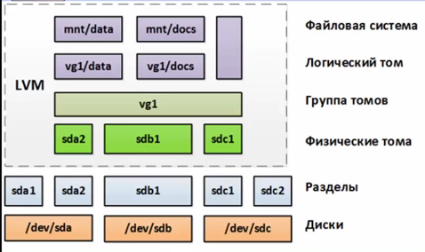

# 102.1 Разбиение жесткого диска

Студент должен уметь разбивать жесткий диск на разделы согласно требованиям Linux. 

### Изучаем:

- расположение файловых систем на разных разделах;
- создание разделов на диске;
- требования к разделу /boot;
- основные возможности LVM.

### Термины и утилиты:	

- / (корень файловой системы)
- /var
- /home
- /boot
- раздел подкачки
- точки монтирования
- разделы

При включении ПК инициализируется ПО материнской платы, которое после всех проверок передает управление первым секторам основного жесткого диска. В этих секторах находятся файлы загрузчика – специального ПО, позволяющего загрузить ядро ОС в оперативную память.

Традиционно в Linux существует единственный корень всей файловой системы (верхняя точка дерева каталогов, обозначаемая символом “/”), а все дополнительные разделы с различных жестких дисков (в том числе сетевые папки, флешки и т.д.) подключаются в ее пустые (можно монтировать и в каталоги с данными «поверх» них) каталоги (точки монтирования).

В случае наличия большого количества носителей (или исходя из требований системы) традиционно можно выделить отдельные разделы жесткого диска под следующие каталоги (в современном мире виртуалок отдельно монтируются директории с данными, а все остальное лежит на едином виртуальном диске):

- /   	– корневая файловая система, самый большой раздел;
- /boot 	– загрузочный раздел;
- /home 	– домашние папки;
- /root 	– домашняя папка суперпользователя;
- /etc 	– конфигурация системы и ее компонентов;
- /opt/ 	– папка для ПО от третьих поставщиков;
- /var 	– часто изменяемые данные;
- /usr 	– все установленные пакеты программ, документация, исходный код ядра;
- /tmp 	– временные файлы;
- swap 	– раздел подкачки, никуда не монтируется.

Отдельно внимание уделяется каталогу /boot, часто монтируемому как отдельный раздел жесткого диска. На нем находятся следующие файлы:

- abi-.. 	функции и библиотеки, через которые к ядру обращаются приложения;
- config-..	файл параметров, при которых создано текущее ядро;
- initrd.img-…	образ стартовой корневой системы, загружающийся в ОЗУ;
- memtest…	файлы ПО проверки ОЗУ;
- system.map..	карта аппаратных адресов системы;
- vmlinuz	..	образ ядра системы.

На каждом жестком диске можно создать не более четырех разделов. Если вдруг потребуется больше разделов, то вместо основного раздела создается расширенный, который в свою очередь может содержать не более четырех логических разделов.

Жесткие диски именуются по порядку подключения: sda, sdb, sdc и т.д.
Разделы на каждом жестком диске нумеруются по порядку: sda1, sda2 и т.д. При этом первые четыре цифры зарезервированы под основные и расширенные разделы, поэтому нумерация логических разделов начинается с **пяти**.

  
Рисунок 1. Разделы жесткого диска

Для создания, изменения, удаления и прочих действий с разделами используется утилита **fdisk**, которая в интерактивном режиме позволяет управлять разбиением жесткого диска (будет подробно изучена в дальнейших уроках).

- `fdisk -l` -- посмотреть имеющиеся диски и разделы
- `fdisk /dev/sdb` -- начало работы с неразмеченным диском
	- n -- новый
		- +2GB -- задать размер раздела в поле "Последний сектор"
	- t -- сменить id раздела (L для списка вариантов после указания раздела)

Для создания файловой системы на разделах используется утилита **mkfs** (будет подробно изучена в дальнейших уроках).

- `mkfs.ext4 /dev/sdb5`

Подключать созданные разделы можно как вручную при помощи команды mount имя_раздела пустой_каталог, так и автоматически с использованием файла настроек /etc/fstab (действия будут подробно изучены в дальнейших уроках).

Раздел подкачки (swap) создается на жестком диске для временного хранения на нем данных, для которых не хватает места в оперативной памяти. Для форматирования раздела как раздела подкачки используется команда **mkswap** (действия будут подробно изучены в дальнейших уроках).

В современных дистрибутивах Linux вместо классических разделов зачастую используются логические тома (раздел – часть диска, а том может располагаться на нескольких дисках одновременно), как более гибкий и надежный способ разбиения дискового пространства. Для этой цели используется LVM – менеджер логических томов.

  
Рисунок 2. LVM

При работе с LVM используются следующие понятия:

- физический носитель – жесткий диск (/dev/sda);
- физический том (PV) – носитель с некой системной инфой, которую понимает LVM;
- физическое пространство (PE – physical extent) – блоки дискового пространства;
- группа томов (VG) – набор PE;
- логический том – результирующее разбиение VG;

Для управления LVM доступен отдельный набор инструментов, например:

- pvdisplay			(отобразить физические тома);
- pvcreate /dev/sdb2	(создать физический том /dev/sdb2);
- vgcreate vg5 /dev/sdb1 /dev/sdb2   (создать группу томов vg5 из двух физических томов);
- lvcreate -n lv2 -L 30G vg1	(создать в группе vg1 логический том lv2 размером 30 Гб);
- lvresize -L 40G vg1/lv2	(изменить размер тома lv2 в группе vg1 до 40 Гб).

По LVM хорошо написано [тут](http://help.ubuntu.ru/wiki/lvm).