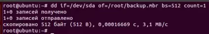
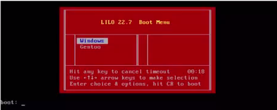

# 102.2 Установка загрузчика

Студент должен уметь выбирать, устанавливать и настраивать загрузчик ОС. 

Изучаем:

доступные загрузочные разделы;
установку и настройку GRUB;
настройку GRUB 2;
взаимодействие с загрузчиком.

Термины и утилиты:	

menu.lst, grub.cfg и grub.conf
grub-install
grub-mkconfig
MBR

При включении ПК инициализируется ПО материнской платы, которое после всех проверок передает управление первым секторам основного жесткого диска. В этих секторах находятся файлы загрузчика – специального ПО, позволяющего загрузить ядро ОС в оперативную память.

  
Создание копии MBR

При первичной инициализации жесткого диска происходит выбор формата таблицы разделов: MBR (с ним работает BIOS) или более современный GUID (с ним работает UEFI).

  
MBR и GPT
	
Существует три самых популярных загрузчика Linux систем:

- LiLo,
- Grub и
- Grub2.

Большинство современных дистрибутивов Linux используют Grub2.

Для настройки загрузчика Lilo используется команда liloconfig. Текущую конфигурацию можно увидеть в файле /etc/lilo.conf. Конфигурационный файл прост для понимания, в нем указаны дисковые устройства, образы ядер, выводимый на экран при загрузке текст и т.д.

Настройки Grub хранятся в файле /boot/grub/grub.conf или /boot/grub/menu.lst. В нем, помимо основных опций загрузки, указаны все доступные для загрузки ОС и порядок обращения к ним.
Grub2 является отдельным проектом, полностью созданным с ноля. Для его установки можно воспользоваться командой grub-install, например:
grub-install /dev/sda	(установить загрузчик на устройство /dev/sda);
Основным файлом конфигурации выбора ОС является файл /boot/grub/grub.cfg, генерируемый автоматически.  Общие настройки загрузчика можно увидеть в файле /etc/default/grub. Скрипты, используемые загрузчиком находятся в директории /etc/grub.d.
Изменения, внесенные в настройки загрузчика можно загрузить в файл конфигурации командой update-grub. Для автоматического создания файла конфигурации (/boot/grub/grub.cfg) с типовым меню можно воспользоваться утилитой grub-mkconfig.
