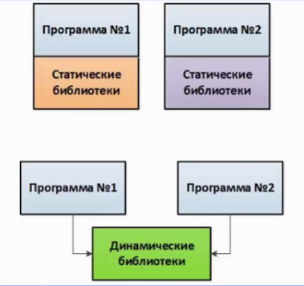

# 102.3 Управление библиотеками

> [To Index](index.md)

Студент должен уметь управлять определять необходимые для работы библиотеки и устанавливать их.

#### Изучаем:

- типы библиотек;
- месторасположение библиотек;
- загрузку библиотек.

#### Термины и утилиты:	

- ldd
- ldconfig
- /etc/ld.so.conf
- LD_LIBRARY_PATH

Библиотеки — это набор функций, используемый ПО при работе. Библиотеки могут входить в состав программного обеспечения, а могут храниться отдельно, загружаясь в оперативную память по мере необходимости. Как правило процесс установки библиотеки - это обычный процесс установки пакета ПО.

В Linux библиотеки располагаются тут:

- /lib 	- библиотеки для ПО, располагаемого в /bin;
- /usr/lib - библиотеки для ПО, располагаемого в /usr/bin;
- прочие пути, указанные в файле /etc/ld.so.conf (по умолчанию это /etc/ld.so.conf.d).

Кроме того, набор возможных расположений библиотек определяется значением переменной **LD_LIBRARY_PATH**.

Активные библиотеки располагаются в кэше (файл /etc/ld.so.cache), для обновления которого необходимо выполнить команду

- `ldconfig` (заново загрузит библиотеки в кэш).

Для определения используемых двоичным файлов программы библиотек необходимо выполнение команды ldd, например:

- `ldd /bin/ls`	(показать библиотеки, используемые командой /bin/ls);

Иногда бывает нужно прописать путь к библиотеке, посмотреть используемые файлы и т.д.

