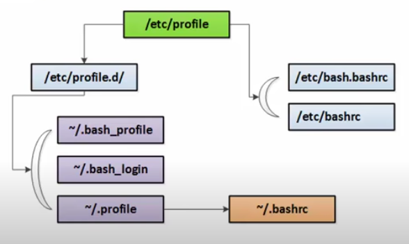

#  омандна€ оболочка и как она инициализируетс€

> [To Index](index.md)

## «апуск оболочки

  
«апуск оболочки

- файл `/etc/profile`
	- в зависимости от пользовател€ (root / NOT root) определ€ет
		- пути к исполн€емым файлам;
		- вид приглашени€ (# / $).
	- запускает через source файл `/etc/bash.bashrc` [NON-interactive];
	- запускает все скрипты из кат-га `/etc/profile.d/` [INTERACTIVE].
- файл `/etc/bash.bashrc`
	- задание нек. алиасов.
- каталог `/etc/skel/` содержит файлы и папки, по-умолчанию создаваемые в домашнем кат-ге каждого нового пользовател€.
- файл `~/.profile` запускает через source файл ~/.bashrc
- файл `~/.bashrc`
	- настрока приглашени€ пользовател€;
	- задание пользовательских алиасов.

> [Next](105_1-2.md)